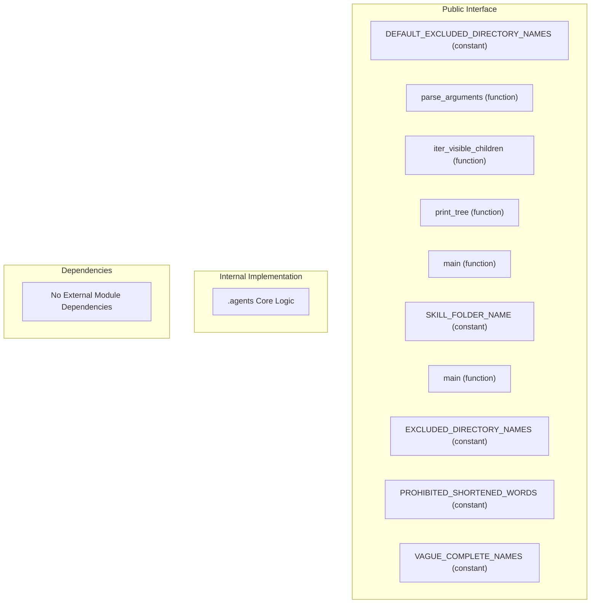
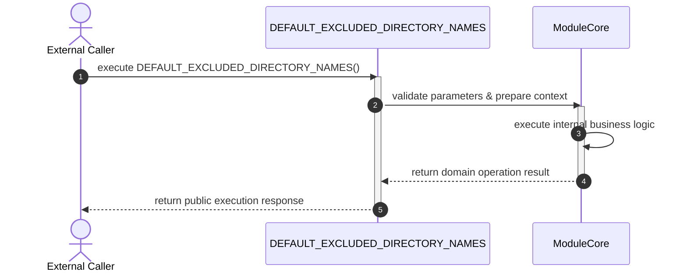

# Module Architecture & Execution Diagrams: .agents
<!-- Auto-generated by project-index diagram generator. Do not edit manually. -->

## Architectural Flowchart

```mermaid
flowchart TD
  subgraph PublicInterface["Public Interface"]
    public_1["DEFAULT_EXCLUDED_DIRECTORY_NAMES (constant)"]
    public_2["parse_arguments (function)"]
    public_3["iter_visible_children (function)"]
    public_4["print_tree (function)"]
    public_5["main (function)"]
    public_6["SKILL_FOLDER_NAME (constant)"]
    public_7["main (function)"]
    public_8["EXCLUDED_DIRECTORY_NAMES (constant)"]
    public_9["PROHIBITED_SHORTENED_WORDS (constant)"]
    public_10["VAGUE_COMPLETE_NAMES (constant)"]
  end
  subgraph InternalImplementation["Internal Implementation"]
    internal_core[".agents Core Logic"]
  end
  subgraph ExternalDependencies["Dependencies"]
    dep_none["No External Module Dependencies"]
  end

  %% Relationships
```

## Execution Sequence Diagram

```mermaid
sequenceDiagram
    autonumber
    actor Client as External Caller
    participant PublicAPI as DEFAULT_EXCLUDED_DIRECTORY_NAMES
    participant InternalCore as ModuleCore

    Client->>PublicAPI: execute DEFAULT_EXCLUDED_DIRECTORY_NAMES()
    activate PublicAPI
    PublicAPI->>InternalCore: validate parameters & prepare context
    activate InternalCore
    InternalCore->>InternalCore: execute internal business logic
    InternalCore-->>PublicAPI: return domain operation result
    deactivate InternalCore
    PublicAPI-->>Client: return public execution response
    deactivate PublicAPI
```
