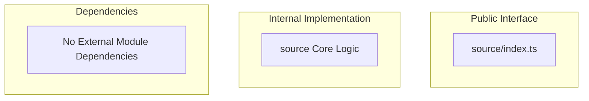
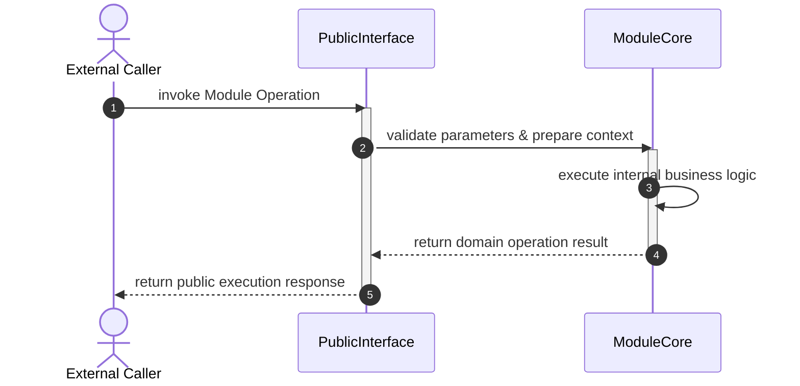

# Module Architecture & Execution Diagrams: source
<!-- Auto-generated by project-index diagram generator. Do not edit manually. -->

## Architectural Flowchart

```mermaid
flowchart TD
  subgraph PublicInterface["Public Interface"]
    public_1["source/index.ts"]
  end
  subgraph InternalImplementation["Internal Implementation"]
    internal_core["source Core Logic"]
  end
  subgraph ExternalDependencies["Dependencies"]
    dep_none["No External Module Dependencies"]
  end

  %% Relationships
```

## Execution Sequence Diagram

```mermaid
sequenceDiagram
    autonumber
    actor Client as External Caller
    participant PublicAPI as PublicInterface
    participant InternalCore as ModuleCore

    Client->>PublicAPI: invoke Module Operation
    activate PublicAPI
    PublicAPI->>InternalCore: validate parameters & prepare context
    activate InternalCore
    InternalCore->>InternalCore: execute internal business logic
    InternalCore-->>PublicAPI: return domain operation result
    deactivate InternalCore
    PublicAPI-->>Client: return public execution response
    deactivate PublicAPI
```
