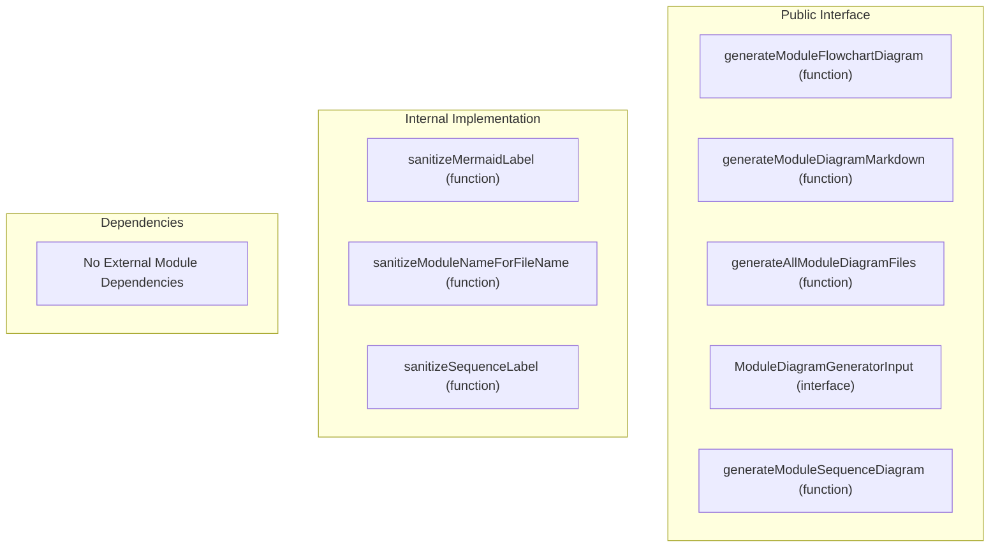
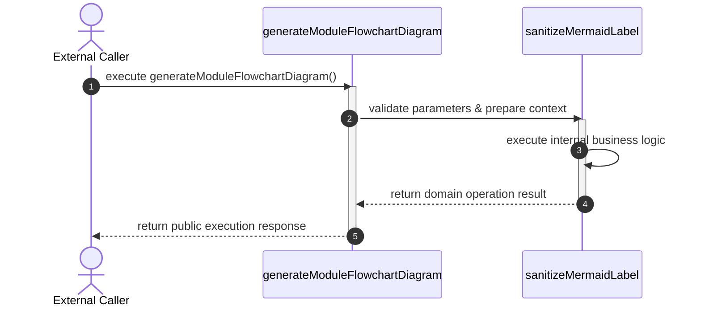

# Module Architecture & Execution Diagrams: source/diagram_generation
<!-- Auto-generated by project-index diagram generator. Do not edit manually. -->

## Architectural Flowchart

## Execution Sequence Diagram

